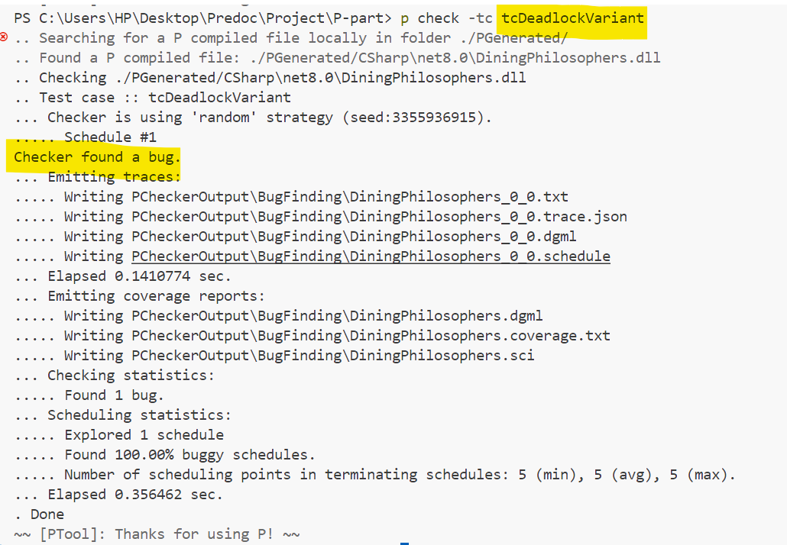
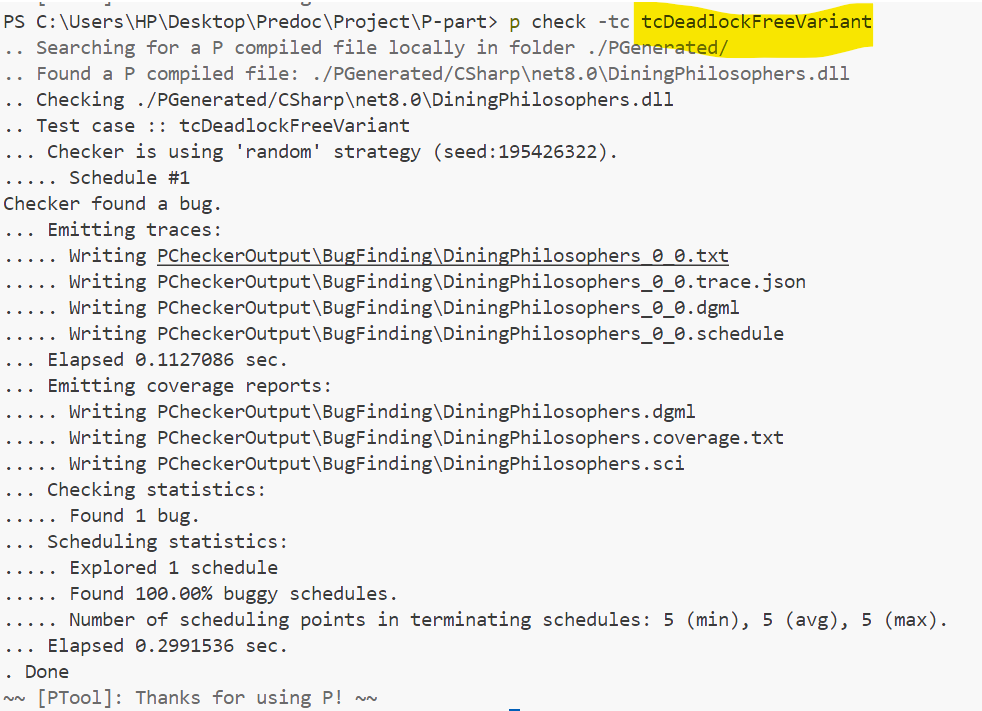
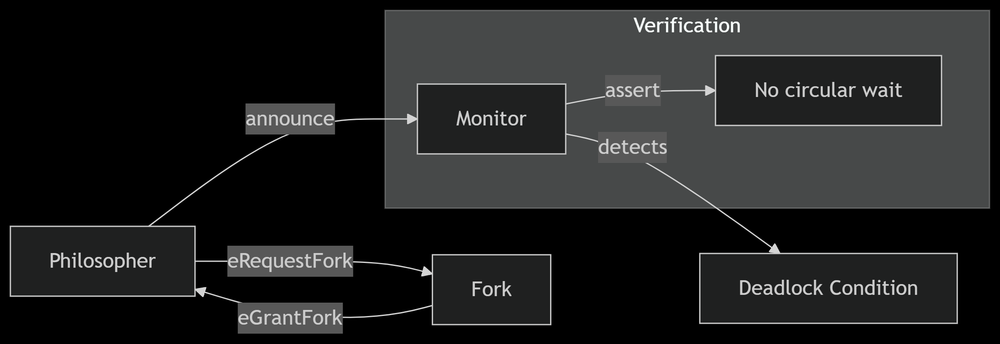

# Dining Philosophers – P verification (2025) - Mehdi Touil - CC

This project implements two variants of the Dining Philosophers problem using the P programming language. It demonstrates deadlock detection and prevention through formal verification.

### 1. Deadlock-Prone Variant
- All philosophers:
  1. Take left fork first
  2. Then request right fork
- Can lead to circular wait deadlock

### 2. Deadlock-Free Variant
- All philosophers except last:
  1. Take left fork first
- Last philosopher:
  1. Takes right fork first
- Breaks circular wait dependency

## Deadlock Detection
The specification detects deadlocks by checking:
```p
if (no philosophers eating) and (all forks held) → DEADLOCK
```


## How to run the p checker from the command line
```p
p compile 
p check 
```
## output
## Deadlock detection


## Deadlock Free


P was able to trace all possibilities to find the deadlock.

## system explanation with graphs

