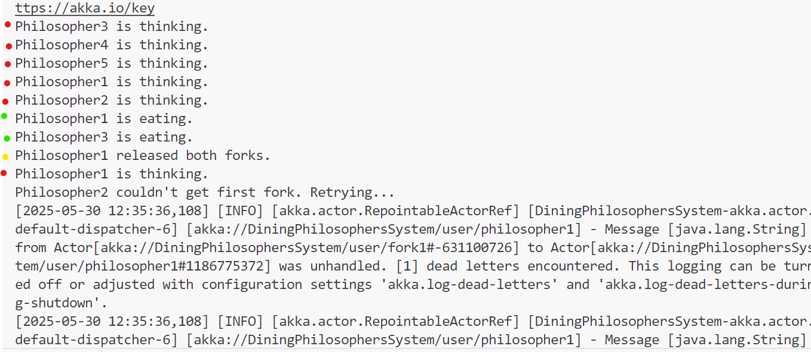

# Dining Philosophers – Akka Implementation (2025) - Mehdi Touil - CC

## Overview
This project implements the Dining Philosophers problem using Akka Actors in Java. Each philosopher and each fork is modeled as a separate actor.

## Deadlock Prevention Strategy
We prevent deadlocks by making one philosopher pick up the **right fork first**, unlike others who pick up the **left fork first**. This avoids circular wait and guarantees deadlock-free execution.

## How to Run the Project
- Open the project in any Java IDE. I used Vs Code.
- Run the `Main` class with Maven : mvn compile exec:exec
- The program runs for 10 seconds and prints each philosopher's actions to the console.
## How to Run the Program so that All 5 Philosophers Eat at Least Once
To ensure that each philosopher gets a chance to eat at least once:

The program includes randomized delays for thinking and eating, and uses a deadlock-free strategy.

It runs for 10 seconds, which is usually enough for all philosophers to eat at least once.

## Expected Output
Each philosopher will:
- Think
- Attempt to eat
- Eat
- Release forks

## Console output sample:

